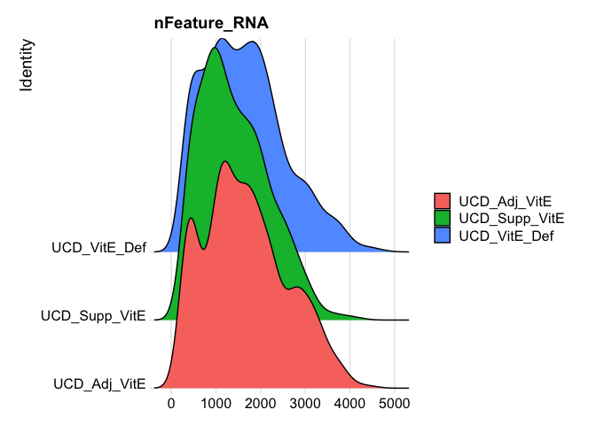
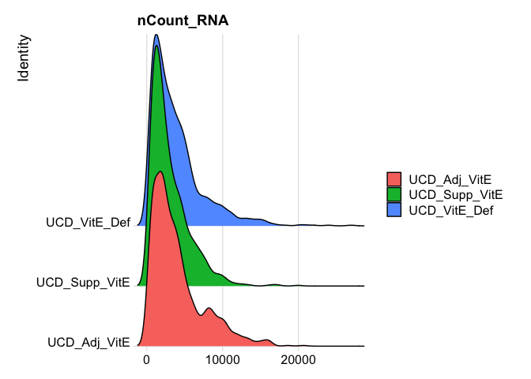
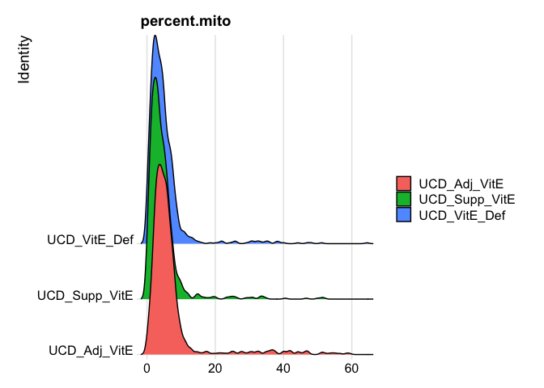
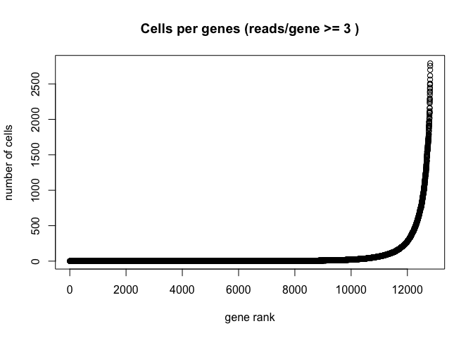
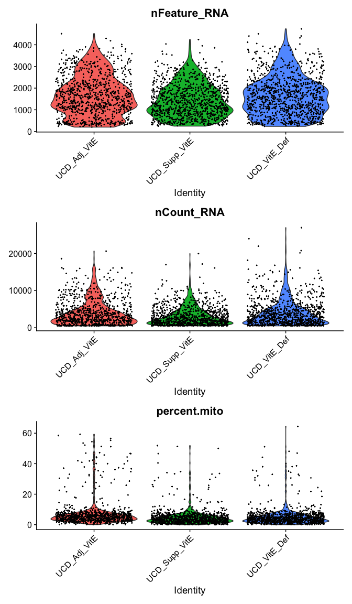
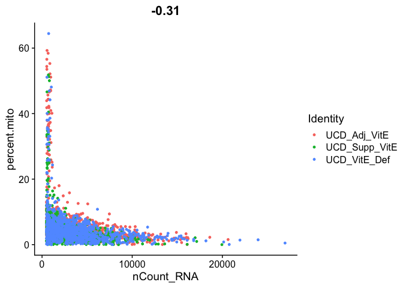
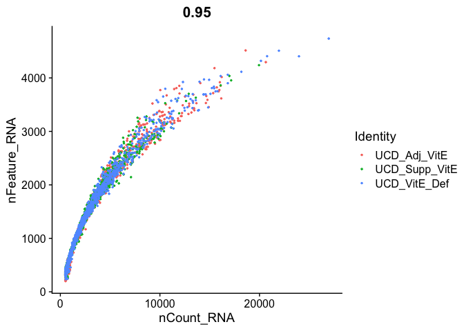
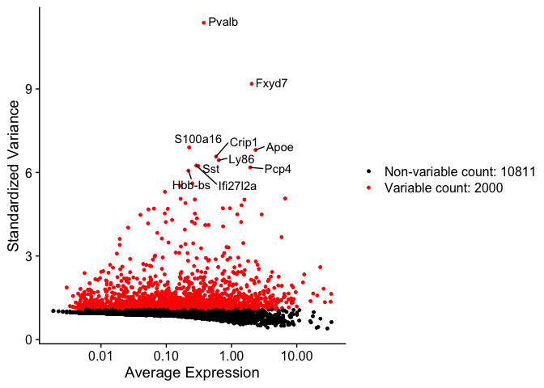

## Load libraries

```r
library(Seurat)
library(biomaRt)
library(knitr)
library(kableExtra)
```

## Load the Seurat object from part 1

```r
load(file="original_seurat_object.RData")
experiment.aggregate
```

<div class='r_output'> An object of class Seurat
 12811 features across 2896 samples within 1 assay
 Active assay: RNA (12811 features, 0 variable features)
</div>
## Some basic QA/QC of the metadata, print tables of the 5% quantiles.

Show 5% quantiles for number of genes per cell per sample

```r
do.call("cbind", tapply(experiment.aggregate$nFeature_RNA, Idents(experiment.aggregate),quantile,probs=seq(0,1,0.05)))
```

<div class='r_output'>      UCD_Adj_VitE UCD_Supp_VitE UCD_VitE_Def
 0%         200.00        246.00       235.00
 5%         357.15        383.00       381.30
 10%        418.50        488.90       475.20
 15%        566.95        592.40       642.90
 20%        847.00        740.00       787.00
 25%       1005.50        829.50       933.50
 30%       1102.00        927.10      1062.00
 35%       1189.05       1003.65      1156.55
 40%       1301.20       1079.80      1267.40
 45%       1427.00       1185.75      1428.90
 50%       1584.50       1302.50      1555.50
 55%       1689.30       1423.45      1671.15
 60%       1814.00       1555.20      1810.00
 65%       1934.70       1661.05      1907.00
 70%       2099.00       1805.80      2038.40
 75%       2250.00       1954.00      2172.50
 80%       2470.80       2063.40      2336.40
 85%       2763.55       2287.05      2578.35
 90%       3001.00       2514.30      2928.90
 95%       3306.05       2801.20      3319.40
 100%      4514.00       4238.00      4735.00
</div>
```r
RidgePlot(experiment.aggregate, features="nFeature_RNA")
```

<div class='r_output'> Picking joint bandwidth of 196
</div>
<!-- -->

Show 5% quantiles for number of UMI per cell per sample

```r
do.call("cbind", tapply(experiment.aggregate$nCount_RNA, Idents(experiment.aggregate),quantile,probs=seq(0,1,0.05)))
```

<div class='r_output'>      UCD_Adj_VitE UCD_Supp_VitE UCD_VitE_Def
 0%         496.00        498.00       499.00
 5%         551.15        565.95       586.00
 10%        693.50        673.90       712.30
 15%        866.90        816.85       894.65
 20%       1287.80       1062.40      1164.60
 25%       1623.00       1209.25      1401.25
 30%       1873.50       1397.90      1690.00
 35%       2067.00       1571.65      1898.55
 40%       2282.40       1776.60      2165.60
 45%       2649.00       2013.25      2581.60
 50%       3036.00       2231.00      2893.00
 55%       3390.85       2521.10      3278.10
 60%       3785.40       2834.40      3647.60
 65%       4142.45       3239.60      4168.00
 70%       4622.80       3673.50      4563.00
 75%       5297.25       4242.75      5018.25
 80%       6229.80       4693.20      5677.40
 85%       7924.55       5442.35      6890.60
 90%       9066.50       6447.30      8489.90
 95%      10963.05       7869.40     11031.10
 100%     20634.00      19948.00     26952.00
</div>
```r
RidgePlot(experiment.aggregate, features="nCount_RNA")
```

<div class='r_output'> Picking joint bandwidth of 585
</div>
<!-- -->

Show 5% quantiles for number of mitochondrial percentage per cell per sample

```r
round(do.call("cbind", tapply(experiment.aggregate$percent.mito, Idents(experiment.aggregate),quantile,probs=seq(0,1,0.05))), digits = 3)
```

<div class='r_output'>      UCD_Adj_VitE UCD_Supp_VitE UCD_VitE_Def
 0%          0.031         0.000        0.000
 5%          1.354         0.653        0.652
 10%         2.059         0.991        1.105
 15%         2.461         1.409        1.536
 20%         2.842         1.693        1.794
 25%         3.179         1.972        2.121
 30%         3.548         2.215        2.411
 35%         3.844         2.598        2.718
 40%         4.233         2.904        3.023
 45%         4.526         3.152        3.399
 50%         4.908         3.429        3.749
 55%         5.346         3.825        4.111
 60%         5.666         4.209        4.482
 65%         6.023         4.662        4.856
 70%         6.482         5.018        5.297
 75%         6.996         5.483        5.834
 80%         7.586         5.980        6.497
 85%         8.356         6.626        7.157
 90%        10.026         7.529        8.059
 95%        27.560        10.056       10.858
 100%       59.279        51.836       64.441
</div>
```r
RidgePlot(experiment.aggregate, features="percent.mito")
```

<div class='r_output'> Picking joint bandwidth of 0.626
</div>
<!-- -->


Plot the number of cells each gene is represented by

```r
plot(sort(Matrix::rowSums(GetAssayData(experiment.aggregate) >= 3)) , xlab="gene rank", ylab="number of cells", main="Cells per genes (reads/gene >= 3 )")
```

<!-- -->

Violin plot of 1) number of genes, 2) number of UMI and 3) percent mitochondrial genes

```r
VlnPlot(
  experiment.aggregate,
  features = c("nFeature_RNA", "nCount_RNA","percent.mito"),
  ncol = 1, pt.size = 0.3)
```

<!-- -->

Gene Plot, scatter plot of gene expression across cells, (colored by sample)

```r
FeatureScatter(experiment.aggregate, feature1 = "nCount_RNA", feature2 = "percent.mito")
```

<!-- -->

```r
FeatureScatter(
  experiment.aggregate, "nCount_RNA", "nFeature_RNA",
  pt.size = 0.5)
```

<!-- -->

### Cell filtering
We use the information above to filter out cells. Here we choose those that have percent mitochondrial genes max of 10% and unique UMI counts under 20,000 or greater than 500.


```r
experiment.aggregate <- subset(experiment.aggregate, percent.mito <= 10)

experiment.aggregate <- subset(experiment.aggregate, nCount_RNA >= 500 & nCount_RNA <= 20000)

experiment.aggregate
```

<div class='r_output'> An object of class Seurat
 12811 features across 2681 samples within 1 assay
 Active assay: RNA (12811 features, 0 variable features)
</div>
### You may also want to filter out additional genes.

When creating the base Seurat object we did filter out some genes, recall _Keep all genes expressed in >= 10 cells_. After filtering cells and you may want to be more aggressive with the gene filter. Seurat doesn't supply such a function (that I can find), so below is a function that can do so, it filters genes requiring a min.value (log-normalized) in at least min.cells, here expression of 1 in at least 400 cells.


```r
FilterGenes <-
 function (object, min.value=1, min.cells = 0, genes = NULL) {
   genes.use <- rownames(object)
   if (!is.null(genes)) {
     genes.use <- intersect(genes.use, genes)
     object@data <- GetAssayData(object)[genes.use, ]
   } else if (min.cells > 0) {
     num.cells <- Matrix::rowSums(GetAssayData(object) > min.value)
     genes.use <- names(num.cells[which(num.cells >= min.cells)])
     object = object[genes.use, ]
   }
  object <- LogSeuratCommand(object = object)
  return(object)
}

experiment.aggregate.genes <- FilterGenes(object = experiment.aggregate, min.value = 1, min.cells = 400)
```

<div class='r_output'> Warning: Adding a command log without an assay associated with it
</div>
```r
experiment.aggregate.genes
```

<div class='r_output'> An object of class Seurat
 1117 features across 2681 samples within 1 assay
 Active assay: RNA (1117 features, 0 variable features)
</div>

```r
table(Idents(experiment.aggregate))
```

<div class='r_output'>
  UCD_Adj_VitE UCD_Supp_VitE  UCD_VitE_Def
           808           947           926
</div>
## Next we want to normalize the data

After filtering out cells from the dataset, the next step is to normalize the data. By default, we employ a global-scaling normalization method LogNormalize that normalizes the gene expression measurements for each cell by the total expression, multiplies this by a scale factor (10,000 by default), and then log-transforms the data.


```r
?NormalizeData
```


```r
experiment.aggregate <- NormalizeData(
  object = experiment.aggregate,
  normalization.method = "LogNormalize",
  scale.factor = 10000)
```


## Calculate cell cycle using scran, add to meta data
(Scialdone A, Natarajana KN, Saraiva LR et al. (2015). Computational assignment of cell-cycle stage from single-cell transcriptome data. Methods 85:54–61])[https://pubmed.ncbi.nlm.nih.gov/26142758/]

Using the package scran, get the mouse cell cycle markers and a mapping of m
**There may be issues with timeout for the Biomart server, just keep trying**

```r
mm.pairs <- readRDS(system.file("exdata", "mouse_cycle_markers.rds", package="scran"))
# Convert to matrix for use in cycle
mat <- as.matrix(GetAssayData(experiment.aggregate))

# Convert rownames to ENSEMBL IDs, Using biomaRt
ensembl<- useEnsembl(biomart = "ensembl", dataset = "mmusculus_gene_ensembl", mirror = "uswest")

anno <- getBM( values=rownames(mat), attributes=c("mgi_symbol","ensembl_gene_id") , filters= "mgi_symbol"  ,mart=ensembl)

ord <- match(rownames(mat), anno$mgi_symbol) # use anno$mgi_symbol if via biomaRt
rownames(mat) <- anno$ensembl_gene_id[ord] # use anno$ensembl_gene_id if via biomaRt
drop <- which(is.na(rownames(mat)))
mat <- mat[-drop,]
cycles <- scran::cyclone(mat, pairs=mm.pairs)
tmp <- data.frame(cell.cycle = cycles$phases)
rownames(tmp) <- colnames(mat)
experiment.aggregate <- AddMetaData(experiment.aggregate, tmp)
```

#### Table of cell cycle (scran)


```r
table(experiment.aggregate@meta.data$cell.cycle) %>% kable(caption = "Number of Cells in each Cell Cycle Stage", col.names = c("Stage", "Count"), align = "c") %>% kable_styling()
```

<table class="table" style="margin-left: auto; margin-right: auto;">
<caption>Number of Cells in each Cell Cycle Stage</caption>
 <thead>
  <tr>
   <th style="text-align:center;"> Stage </th>
   <th style="text-align:center;"> Count </th>
  </tr>
 </thead>
<tbody>
  <tr>
   <td style="text-align:center;"> G1 </td>
   <td style="text-align:center;"> 2590 </td>
  </tr>
  <tr>
   <td style="text-align:center;"> G2M </td>
   <td style="text-align:center;"> 72 </td>
  </tr>
  <tr>
   <td style="text-align:center;"> S </td>
   <td style="text-align:center;"> 19 </td>
  </tr>
</tbody>
</table>

### Calculate Cell-Cycle with Seurat, the list of genes comes with Seurat (only for human)

First need to convert to mouse symbols, we'll use Biomart for that too.

```r
table(Idents(experiment.aggregate))
```

<div class='r_output'>
  UCD_Adj_VitE UCD_Supp_VitE  UCD_VitE_Def
           808           947           926
</div>
```r
convertHumanGeneList <- function(x){
  require("biomaRt")
  human = useEnsembl("ensembl", dataset = "hsapiens_gene_ensembl", mirror = "uswest")
  mouse = useEnsembl("ensembl", dataset = "mmusculus_gene_ensembl", mirror = "uswest")

  genes = getLDS(attributes = c("hgnc_symbol"), filters = "hgnc_symbol", values = x , mart = human, attributesL = c("mgi_symbol"), martL = mouse, uniqueRows=T)

  humanx <- unique(genes[, 2])

  # Print the first 6 genes found to the screen
  print(head(humanx))
  return(humanx)
}

m.s.genes <- convertHumanGeneList(cc.genes.updated.2019$s.genes)
```

<div class='r_output'> Ensembl site unresponsive, trying useast mirror
</div>
<div class='r_output'> Ensembl site unresponsive, trying asia mirror
</div>
<div class='r_output'> [1] "Gmnn"  "Rad51" "Dscc1" "Prim1" "Cenpu" "Mcm7"
</div>
```r
m.g2m.genes <- convertHumanGeneList(cc.genes.updated.2019$g2m.genes)
```

<div class='r_output'> Ensembl site unresponsive, trying uswest mirror
</div>
<div class='r_output'> [1] "Tacc3"  "Tmpo"   "Smc4"   "Cdk1"   "Ckap2l" "Cks2"
</div>
```r
# Create our Seurat object and complete the initialization steps
experiment.aggregate <- CellCycleScoring(experiment.aggregate, s.features = m.s.genes, g2m.features = m.g2m.genes, set.ident = TRUE)
```

<div class='r_output'> Warning: The following features are not present in the object: Dscc1, Cenpu,
 Cdca7, Clspn, E2f8, Cdc45, Uhrf1, Ung, Exo1, Cdc6, Dtl, not searching for symbol
 synonyms
</div>
<div class='r_output'> Warning: The following features are not present in the object: Cdk1, Ckap2l,
 Cdc25c, Top2a, Nusap1, Dlgap5, Kif2c, Kif20b, Nek2, Ube2c, Cks1brt, Cenpe,
 Cdc20, Ndc80, Nuf2, Aurkb, Hmmr, Psrc1, Pimreg, Gtse1, Cdca2, Ttk, Bub1, Ccnb2,
 not searching for symbol synonyms
</div>
#### Table of cell cycle (seurate)


```r
table(experiment.aggregate@meta.data$Phase) %>% kable(caption = "Number of Cells in each Cell Cycle Stage", col.names = c("Stage", "Count"), align = "c") %>% kable_styling()
```

<table class="table" style="margin-left: auto; margin-right: auto;">
<caption>Number of Cells in each Cell Cycle Stage</caption>
 <thead>
  <tr>
   <th style="text-align:center;"> Stage </th>
   <th style="text-align:center;"> Count </th>
  </tr>
 </thead>
<tbody>
  <tr>
   <td style="text-align:center;"> G1 </td>
   <td style="text-align:center;"> 945 </td>
  </tr>
  <tr>
   <td style="text-align:center;"> G2M </td>
   <td style="text-align:center;"> 854 </td>
  </tr>
  <tr>
   <td style="text-align:center;"> S </td>
   <td style="text-align:center;"> 882 </td>
  </tr>
</tbody>
</table>

#### Comparing the 2


```r
table(scran=experiment.aggregate$cell.cycle, seurat=experiment.aggregate$Phase)  %>% kable(caption = "Comparing scran to seurat cell cycle calls", align = "c") %>% kable_styling()
```

<table class="table" style="margin-left: auto; margin-right: auto;">
<caption>Comparing scran to seurat cell cycle calls</caption>
 <thead>
  <tr>
   <th style="text-align:left;">   </th>
   <th style="text-align:center;"> G1 </th>
   <th style="text-align:center;"> G2M </th>
   <th style="text-align:center;"> S </th>
  </tr>
 </thead>
<tbody>
  <tr>
   <td style="text-align:left;"> G1 </td>
   <td style="text-align:center;"> 914 </td>
   <td style="text-align:center;"> 817 </td>
   <td style="text-align:center;"> 859 </td>
  </tr>
  <tr>
   <td style="text-align:left;"> G2M </td>
   <td style="text-align:center;"> 26 </td>
   <td style="text-align:center;"> 31 </td>
   <td style="text-align:center;"> 15 </td>
  </tr>
  <tr>
   <td style="text-align:left;"> S </td>
   <td style="text-align:center;"> 5 </td>
   <td style="text-align:center;"> 6 </td>
   <td style="text-align:center;"> 8 </td>
  </tr>
</tbody>
</table>

#### Fixing the defualt "Ident" in Seurat


```r
table(Idents(experiment.aggregate))
```

<div class='r_output'>
 G2M   S  G1
 854 882 945
</div>
```r
## So lets change it back to samplename
Idents(experiment.aggregate) <- "orig.ident"
table(Idents(experiment.aggregate))
```

<div class='r_output'>
  UCD_Adj_VitE UCD_Supp_VitE  UCD_VitE_Def
           808           947           926
</div>

## Identify variable genes

The function FindVariableFeatures identifies the most highly variable genes (default 2000 genes) by fitting a line to the relationship of log(variance) and log(mean) using loess smoothing, uses this information to standardize the data, then calculates the variance of the standardized data.  This helps avoid selecting genes that only appear variable due to their expression level.


```r
?FindVariableFeatures

experiment.aggregate <- FindVariableFeatures(
  object = experiment.aggregate,
  selection.method = "vst")

length(VariableFeatures(experiment.aggregate))
```

<div class='r_output'> [1] 2000
</div>
```r
top10 <- head(VariableFeatures(experiment.aggregate), 10)

top10
```

<div class='r_output'>  [1] "Pvalb"    "Fxyd7"    "S100a16"  "Apoe"     "Crip1"    "Ly86"    
  [7] "Ifi27l2a" "Sst"      "Pcp4"     "Hbb-bs"
</div>
```r
vfp1 <- VariableFeaturePlot(experiment.aggregate)
vfp1 <- LabelPoints(plot = vfp1, points = top10, repel = TRUE)
vfp1
```

<!-- -->

#### Question(s)

1. Play some with the filtering parameters, see how results change?
2. How do the results change if you use selection.method = "dispersion" or selection.method = "mean.var.plot"


## Finally, lets save the filtered and normalized data

```r
save(experiment.aggregate, file="pre_sample_corrected.RData")
```

## Get the next Rmd file

```r
download.file("https://raw.githubusercontent.com/ucdavis-bioinformatics-training/2020-Intro_Single_Cell_RNA_Seq/master/data_analysis/scRNA_Workshop-PART3.Rmd", "scRNA_Workshop-PART3.Rmd")
```

## Session Information

```r
sessionInfo()
```

<div class='r_output'> R version 4.0.0 (2020-04-24)
 Platform: x86_64-apple-darwin17.0 (64-bit)
 Running under: macOS Catalina 10.15.4

 Matrix products: default
 BLAS:   /Library/Frameworks/R.framework/Versions/4.0/Resources/lib/libRblas.dylib
 LAPACK: /Library/Frameworks/R.framework/Versions/4.0/Resources/lib/libRlapack.dylib

 locale:
 [1] en_US.UTF-8/en_US.UTF-8/en_US.UTF-8/C/en_US.UTF-8/en_US.UTF-8

 attached base packages:
 [1] stats     graphics  grDevices datasets  utils     methods   base     

 other attached packages:
 [1] kableExtra_1.1.0 knitr_1.28       biomaRt_2.44.0   Seurat_3.1.5    

 loaded via a namespace (and not attached):
   [1] BiocFileCache_1.12.0        plyr_1.8.6                 
   [3] igraph_1.2.5                lazyeval_0.2.2             
   [5] splines_4.0.0               BiocParallel_1.22.0        
   [7] listenv_0.8.0               GenomeInfoDb_1.24.0        
   [9] ggplot2_3.3.0               scater_1.16.0              
  [11] digest_0.6.25               htmltools_0.4.0            
  [13] viridis_0.5.1               magrittr_1.5               
  [15] memoise_1.1.0               cluster_2.1.0              
  [17] ROCR_1.0-11                 limma_3.44.1               
  [19] globals_0.12.5              readr_1.3.1                
  [21] matrixStats_0.56.0          askpass_1.1                
  [23] prettyunits_1.1.1           colorspace_1.4-1           
  [25] blob_1.2.1                  rvest_0.3.5                
  [27] rappdirs_0.3.1              ggrepel_0.8.2              
  [29] xfun_0.13                   dplyr_0.8.5                
  [31] crayon_1.3.4                RCurl_1.98-1.2             
  [33] jsonlite_1.6.1              survival_3.1-12            
  [35] zoo_1.8-8                   ape_5.3                    
  [37] glue_1.4.1                  gtable_0.3.0               
  [39] zlibbioc_1.34.0             XVector_0.28.0             
  [41] webshot_0.5.2               leiden_0.3.3               
  [43] DelayedArray_0.14.0         BiocSingular_1.4.0         
  [45] future.apply_1.5.0          SingleCellExperiment_1.10.1
  [47] BiocGenerics_0.34.0         scales_1.1.1               
  [49] DBI_1.1.0                   edgeR_3.30.0               
  [51] Rcpp_1.0.4.6                viridisLite_0.3.0          
  [53] progress_1.2.2              reticulate_1.15            
  [55] dqrng_0.2.1                 bit_1.1-15.2               
  [57] rsvd_1.0.3                  stats4_4.0.0               
  [59] tsne_0.1-3                  htmlwidgets_1.5.1          
  [61] httr_1.4.1                  RColorBrewer_1.1-2         
  [63] ellipsis_0.3.1              ica_1.0-2                  
  [65] pkgconfig_2.0.3             XML_3.99-0.3               
  [67] farver_2.0.3                uwot_0.1.8                 
  [69] dbplyr_1.4.3                locfit_1.5-9.4             
  [71] tidyselect_1.1.0            labeling_0.3               
  [73] rlang_0.4.6                 reshape2_1.4.4             
  [75] AnnotationDbi_1.50.0        munsell_0.5.0              
  [77] tools_4.0.0                 RSQLite_2.2.0              
  [79] ggridges_0.5.2              evaluate_0.14              
  [81] stringr_1.4.0               yaml_2.2.1                 
  [83] bit64_0.9-7                 fitdistrplus_1.1-1         
  [85] purrr_0.3.4                 RANN_2.6.1                 
  [87] pbapply_1.4-2               future_1.17.0              
  [89] nlme_3.1-147                scran_1.16.0               
  [91] xml2_1.3.2                  compiler_4.0.0             
  [93] rstudioapi_0.11             beeswarm_0.2.3             
  [95] plotly_4.9.2.1              curl_4.3                   
  [97] png_0.1-7                   statmod_1.4.34             
  [99] tibble_3.0.1                stringi_1.4.6              
 [101] highr_0.8                   lattice_0.20-41            
 [103] Matrix_1.2-18               vctrs_0.3.0                
 [105] pillar_1.4.4                lifecycle_0.2.0            
 [107] BiocManager_1.30.10         lmtest_0.9-37              
 [109] RcppAnnoy_0.0.16            BiocNeighbors_1.6.0        
 [111] data.table_1.12.8           cowplot_1.0.0              
 [113] bitops_1.0-6                irlba_2.3.3                
 [115] patchwork_1.0.0             GenomicRanges_1.40.0       
 [117] R6_2.4.1                    renv_0.10.0                
 [119] KernSmooth_2.23-16          gridExtra_2.3              
 [121] vipor_0.4.5                 IRanges_2.22.1             
 [123] codetools_0.2-16            MASS_7.3-51.5              
 [125] assertthat_0.2.1            SummarizedExperiment_1.18.1
 [127] openssl_1.4.1               withr_2.2.0                
 [129] sctransform_0.2.1           S4Vectors_0.26.1           
 [131] GenomeInfoDbData_1.2.3      parallel_4.0.0             
 [133] hms_0.5.3                   grid_4.0.0                 
 [135] tidyr_1.0.3                 rmarkdown_2.1              
 [137] DelayedMatrixStats_1.10.0   Rtsne_0.15                 
 [139] Biobase_2.48.0              ggbeeswarm_0.6.0
</div>
