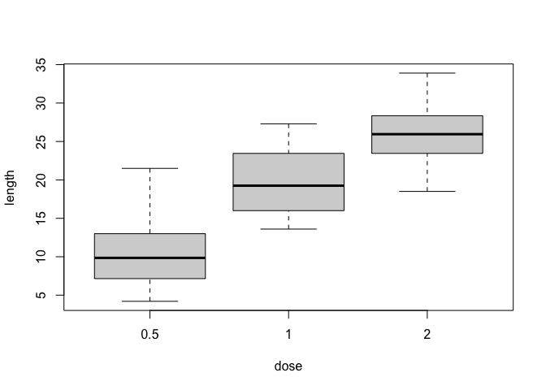
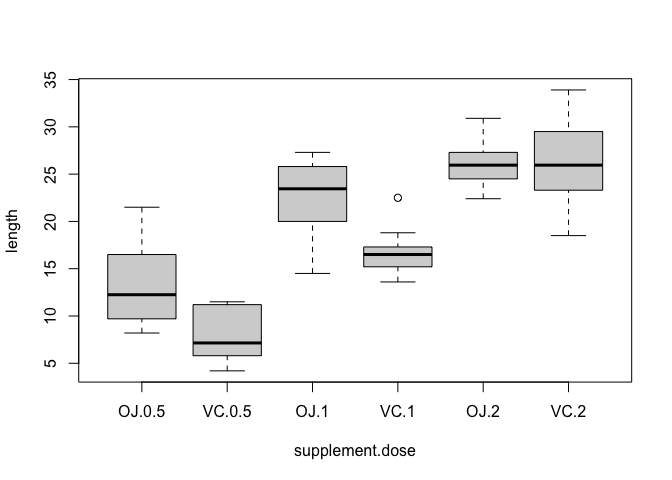
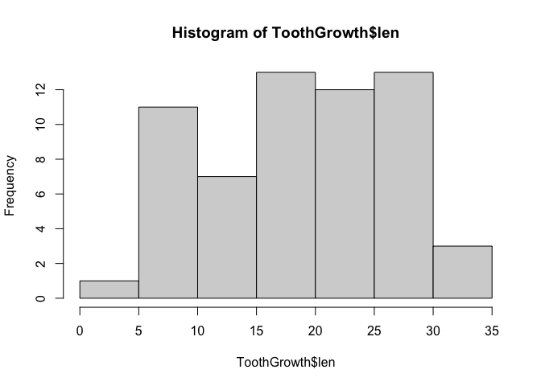
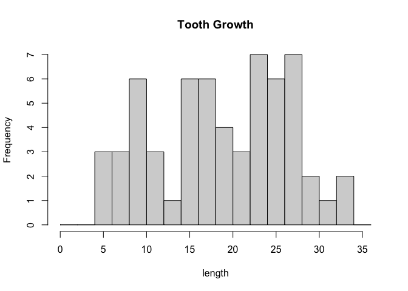
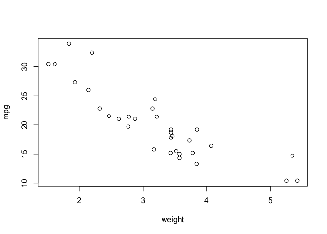

To download the R notebook for this portion of the course, execute the following command in your R console:


```r
download.file("https://raw.githubusercontent.com/ucdavis-bioinformatics-training/2020-August-intro-scRNAseq/master/prerequisites/intro2R/Intro2R.Rmd", "Intro2R.Rmd")
```

---

Topics covered in this introduction to R
====================================================
1. Basic concepts
2. Basic data types in R
3. Import and export data in R
4. Basic statistics in R
5. Simple data visualization in R
6. Install packages in R

---

Topic 1. Basic concepts
====================================================

Everything we will deal with in R during this workshop is either:

* an operator
* a function
* a variable / an object

### Operators

We use operators to tell R to perform arithmetic or logical operations. Arithmetic operations are things like addition and subtraction. Logical operations allow us to ask R questions like "which samples came from females?"
<table class="table table-striped" style="width: auto !important; ">
<caption>Assignment Operators in R</caption>
 <thead>
  <tr>
   <th style="text-align:center;"> Operator </th>
   <th style="text-align:center;"> Description </th>
  </tr>
 </thead>
<tbody>
  <tr>
   <td style="text-align:center;"> &lt;-, = </td>
   <td style="text-align:center;"> Assignment </td>
  </tr>
</tbody>
</table>

<table class="table table-striped" style="width: auto !important; ">
<caption>Arithmetic Operators in R</caption>
 <thead>
  <tr>
   <th style="text-align:center;"> Operator </th>
   <th style="text-align:center;"> Description </th>
  </tr>
 </thead>
<tbody>
  <tr>
   <td style="text-align:center;"> + </td>
   <td style="text-align:center;"> Addition </td>
  </tr>
  <tr>
   <td style="text-align:center;"> - </td>
   <td style="text-align:center;"> Subtraction </td>
  </tr>
  <tr>
   <td style="text-align:center;"> * </td>
   <td style="text-align:center;"> Multiplication </td>
  </tr>
  <tr>
   <td style="text-align:center;"> / </td>
   <td style="text-align:center;"> Division </td>
  </tr>
  <tr>
   <td style="text-align:center;"> ^ </td>
   <td style="text-align:center;"> Exponent </td>
  </tr>
  <tr>
   <td style="text-align:center;"> %% </td>
   <td style="text-align:center;"> Modulus </td>
  </tr>
  <tr>
   <td style="text-align:center;"> %/% </td>
   <td style="text-align:center;"> Integer Division </td>
  </tr>
</tbody>
</table>

<table class="table table-striped" style="width: auto !important; ">
<caption>Relational Operators in R</caption>
 <thead>
  <tr>
   <th style="text-align:center;"> Operator </th>
   <th style="text-align:center;"> Description </th>
  </tr>
 </thead>
<tbody>
  <tr>
   <td style="text-align:center;"> &lt; </td>
   <td style="text-align:center;"> Less than </td>
  </tr>
  <tr>
   <td style="text-align:center;"> &gt; </td>
   <td style="text-align:center;"> Greater than </td>
  </tr>
  <tr>
   <td style="text-align:center;"> &lt;= </td>
   <td style="text-align:center;"> Less than or equal to </td>
  </tr>
  <tr>
   <td style="text-align:center;"> &gt;= </td>
   <td style="text-align:center;"> Greater than or equal to </td>
  </tr>
  <tr>
   <td style="text-align:center;"> == </td>
   <td style="text-align:center;"> Equal to </td>
  </tr>
  <tr>
   <td style="text-align:center;"> != </td>
   <td style="text-align:center;"> Not equal to </td>
  </tr>
</tbody>
</table>

<table class="table table-striped" style="width: auto !important; ">
<caption>Logical Operators in R</caption>
 <thead>
  <tr>
   <th style="text-align:center;"> Operator </th>
   <th style="text-align:center;"> Description </th>
  </tr>
 </thead>
<tbody>
  <tr>
   <td style="text-align:center;"> ! </td>
   <td style="text-align:center;"> Logical NOT </td>
  </tr>
  <tr>
   <td style="text-align:center;"> &amp; </td>
   <td style="text-align:center;"> Element-wise logical AND </td>
  </tr>
  <tr>
   <td style="text-align:center;"> &amp;&amp; </td>
   <td style="text-align:center;"> Logical AND </td>
  </tr>
  <tr>
   <td style="text-align:center;"> | </td>
   <td style="text-align:center;"> Element-wise logical OR </td>
  </tr>
  <tr>
   <td style="text-align:center;"> || </td>
   <td style="text-align:center;"> Logical OR </td>
  </tr>
</tbody>
</table>


```r
# arithmetic
1 + 3
```

```
## [1] 4
```

```r
# logical
1 > 3
```

```
## [1] FALSE
```

### Functions

Functions are essential in all programming languages. A function takes zero or more parameters and returns a result. The way to use a function in R is:

function.name(parameter1=value1, ...)

Help documentation about functions can be displayed by putting a "?" before the function name.

```r
?getwd # what does getwd() do?
getwd()
```

```
## [1] "/Users/hannah/Documents/Jobs/bioinformatics_training_program/workshop_documentation/intro_scRNA_aug/prerequisites/intro2R"
```

```r
ls()
```

```
## [1] "colFmt"
```

```r
sum(1, 3)
```

```
## [1] 4
```

```r
seq(from = 2, to = 3, by = 0.1)
```

```
##  [1] 2.0 2.1 2.2 2.3 2.4 2.5 2.6 2.7 2.8 2.9 3.0
```

### Variables

Variables (and objects) give us a way to store data for use later and refer to it by name. The name of a variable can have letters, numbers, dot and underscore. However, a valid variable name cannot start with a underscore or a number, or start with a dot that is followed by a number.

Using an assignment operator, we can store the results of a function inside a variable. In many cases, the assignment operators "<-" and "=" are equivalent. There are, however, some differences. In this introductory material, we will use "<-" for assignment and "=" to define parameters within functions.


```r
total <- sum(1, 3)
```

##### CHALLENGE

Which of the following assignments will work? Do you notice anything different about the behavior of any of these variables?


```r
a <- 1
b = 2
.c <- 3
1a <- 4
.1a <- 5
a.1 <- 6
```


---

Topic 2. Basic data types in R
====================================================

The data types we will encounter in this workshop are numeric, character, logical, and factor.
<table class="table table-striped" style="width: auto !important; ">
<caption>Basic Data Types</caption>
 <thead>
  <tr>
   <th style="text-align:center;"> Type </th>
   <th style="text-align:center;"> Example </th>
  </tr>
 </thead>
<tbody>
  <tr>
   <td style="text-align:center;"> Numeric </td>
   <td style="text-align:center;"> 3, 3e-2 </td>
  </tr>
  <tr>
   <td style="text-align:center;"> Character </td>
   <td style="text-align:center;"> "ENSMUSG00000102693" </td>
  </tr>
  <tr>
   <td style="text-align:center;"> Logical </td>
   <td style="text-align:center;"> TRUE, FALSE </td>
  </tr>
  <tr>
   <td style="text-align:center;"> Factor </td>
   <td style="text-align:center;"> any categorical variable </td>
  </tr>
</tbody>
</table>

We will cover factors in greater depth later. First let's explore the other data types. To check the type of a variable, use the class function.

```r
a <- 1
class(a)
```

```
## [1] "numeric"
```

```r
a <- "ENSMUSG00000102693"
class(a)
```

```
## [1] "character"
```

##### CHALLENGE

Try the following assignments. What is the class of each of the variables produced? Why? What is happening when converting between types using the as.numeric, as.logical, and as.character functions?

```r
a <- 150
b <- 3e-2
c <- "ENSMUSG00000102693"
d <- TRUE
e <- a < 1
f <- b < 1
g <- is.numeric(a)
h <- is.character(a)
i <- as.numeric(d)
j <- as.character(a)
l <- as.logical(b)
m <- as.numeric(f)
n <- as.logical(0)
```

To store more than a single data point, R uses data structures, including vectors, matrices, data frames, lists, and complex objects. We will focus on vectors and data frames for now.

#### Vectors

Vectors store a group of values of the same type within a single object. A vector is created by combining values using the function c().

```r
gene_ids <- c("ENSMUSG00000102693", "ENSMUSG00000064842", "ENSMUSG00000051951")
gene_ids
```

```
## [1] "ENSMUSG00000102693" "ENSMUSG00000064842" "ENSMUSG00000051951"
```

```r
of_interest <- c(TRUE, FALSE, FALSE)
of_interest
```

```
## [1]  TRUE FALSE FALSE
```

```r
length(of_interest)
```

```
## [1] 3
```

Elements of a vector can be named by providing names to an existing vector, or assigning names when creating a vector.

```r
names(of_interest) <- gene_ids
of_interest
```

```
## ENSMUSG00000102693 ENSMUSG00000064842 ENSMUSG00000051951
##               TRUE              FALSE              FALSE
```

```r
of_interest <- c(ENSMUSG00000102693 = TRUE, ENSMUSG00000064842 = FALSE, ENSMUSG00000051951 = FALSE)
of_interest
```

```
## ENSMUSG00000102693 ENSMUSG00000064842 ENSMUSG00000051951
##               TRUE              FALSE              FALSE
```

Elements of a vector can be accessed by index, or by name if it is a named vector. The element or elements to be accessed are specified using square brackets.

```r
of_interest[2]
```

```
## ENSMUSG00000064842
##              FALSE
```

```r
of_interest["ENSMUSG00000064842"]
```

```
## ENSMUSG00000064842
##              FALSE
```

```r
of_interest[c(1,3)]
```

```
## ENSMUSG00000102693 ENSMUSG00000051951
##               TRUE              FALSE
```

```r
of_interest[c("ENSMUSG00000102693", "ENSMUSG00000051951")]
```

```
## ENSMUSG00000102693 ENSMUSG00000051951
##               TRUE              FALSE
```

Additionally, a subset of a vector can be selected using a logical vector.

```r
gene_ids[of_interest]
```

```
## [1] "ENSMUSG00000102693"
```

A factor represents categorical data, or groups in data. The function factor() can be used to create a factor.

```r
treatment <- factor(c(1,2,1,2))
treatment
```

```
## [1] 1 2 1 2
## Levels: 1 2
```

```r
class(treatment)
```

```
## [1] "factor"
```

In R, categories are called factor levels. The function levels() can be used to access the factor levels.


```r
levels(treatment)
```

```
## [1] "1" "2"
```

Factor levels can also be changed by assigning new levels to a factor.


```r
levels(treatment) <- c("A", "C")
treatment
```

```
## [1] A C A C
## Levels: A C
```

Change the order of levels.


```r
levels(treatment) <- c("C", "A")
treatment
```

```
## [1] C A C A
## Levels: C A
```

By default, the order of factor levels is taken in the order of numeric or alphabetic.


```r
treatment <- factor(c("C", "A", "C", "A"))
treatment
```

```
## [1] C A C A
## Levels: A C
```

The factor levels can be specified when creating the factor, if the order does not follow the default rule.


```r
treatment <- factor(c("C", "A", "C", "A"), levels=c("C", "A"))
treatment
```

```
## [1] C A C A
## Levels: C A
```

If you want to know the number of individuals at each levels, there are two simple functions we can use to summarize the information contained in a factor.


```r
summary(treatment)
```

```
## C A
## 2 2
```


```r
table(treatment)
```

```
## treatment
## C A
## 2 2
```

#### Data frames

A data frame looks a bit like a spreadsheet, and can contain different types of data in each column. A data frame can be created using the function data.frame(), from new or previously defined vectors.


```r
genes <- data.frame(ensembl = gene_ids, interest = of_interest)
genes
```

```
##                               ensembl interest
## ENSMUSG00000102693 ENSMUSG00000102693     TRUE
## ENSMUSG00000064842 ENSMUSG00000064842    FALSE
## ENSMUSG00000051951 ENSMUSG00000051951    FALSE
```

```r
genes <- data.frame(ensembl = c("ENSMUSG00000102693", "ENSMUSG00000064842", "ENSMUSG00000051951"), interest = c(TRUE, FALSE, FALSE))
genes
```

```
##              ensembl interest
## 1 ENSMUSG00000102693     TRUE
## 2 ENSMUSG00000064842    FALSE
## 3 ENSMUSG00000051951    FALSE
```

```r
is.data.frame(genes)
```

```
## [1] TRUE
```

The syntax to specify a subset of data within a data frame looks a lot like the syntax to specify a subset of a vector, except for a data frame, we need to specify both row and column, rather than index:

dataframe[row, column]

We can use the row and column number, row and column names, or logical vectors to subset a data frame.

```r
genes[1,]
```

```
##              ensembl interest
## 1 ENSMUSG00000102693     TRUE
```

```r
genes[, "ensembl"]
```

```
## [1] "ENSMUSG00000102693" "ENSMUSG00000064842" "ENSMUSG00000051951"
```

```r
genes[of_interest,]
```

```
##              ensembl interest
## 1 ENSMUSG00000102693     TRUE
```

A column of a data frame can be specified using the "$".

```r
genes$ensembl
```

```
## [1] "ENSMUSG00000102693" "ENSMUSG00000064842" "ENSMUSG00000051951"
```

```r
genes[genes$interest,]
```

```
##              ensembl interest
## 1 ENSMUSG00000102693     TRUE
```

Data frames are easily extended using the "$" as well.


```r
genes$name <- c("4933401J01Rik", "Gm26206", "Xkr4")
genes
```

```
##              ensembl interest          name
## 1 ENSMUSG00000102693     TRUE 4933401J01Rik
## 2 ENSMUSG00000064842    FALSE       Gm26206
## 3 ENSMUSG00000051951    FALSE          Xkr4
```

##### CHALLENGE

Let's explore a data frame. R has several built-in data sets. We will use "ToothGrowth," which contains the results of an experiment investigating the results of vitamin C supplementation on tooth growth in Guinea pigs.


```r
class(ToothGrowth)
```

```
## [1] "data.frame"
```

What type of data is stored in ToothGrowth? Can you access a subset of that data? Can you add a column to ToothGrowth? Explore ToothGrowth using the following functions:

```r
rownames()
colnames()
class()
```

---

Topic 3. Import and export data in R
====================================================

R base function read.table() is a general function that can be used to read a file in table format. There are also several variants of read.table that can be used to make reading a file even easier, like read.delim. The data will be imported as a data frame.

To read a local file, provide read.table with the path to the file's location.

```r
download.file("https://raw.githubusercontent.com/ucdavis-bioinformatics-training/2020-August-intro-scRNAseq/master/datasets/scran_biomart.txt", "scran.txt")
scran <- read.table(file="scran.txt", sep="\t", header=T, stringsAsFactors=F)
```

To read a file from the internet, provide read.table with the URL.

```r
scran2 <- read.table(file="https://raw.githubusercontent.com/ucdavis-bioinformatics-training/2020-August-intro-scRNAseq/master/datasets/scran_biomart.txt", sep="\t", header=T, stringsAsFactors=F)
```

Take a look at the beginning part of the data frame.

```r
head(scran)
```

```
##      mgi_symbol    ensembl_gene_id
## 1 0610040J01Rik ENSMUSG00000060512
## 2 1110008P14Rik ENSMUSG00000039195
## 3 1110012L19Rik ENSMUSG00000045237
## 4 1110032F04Rik ENSMUSG00000046999
## 5 1110051M20Rik ENSMUSG00000040591
## 6 1110065P20Rik ENSMUSG00000078570
```


Depending on the format of the file, several variants of read.table() are available to make reading a file easier, including read.csv, read.csv2, read.delim, and read.delim2.

Choosing the correct function (or parameters) is important!

##### CHALLENGE

What happens when you use read.csv on the file instead? Why?

```r
scran2 <- read.csv(file="scran.txt", stringsAsFactors=F)
head(scran2)
rm(scran, scran2)
```


R base function write.table() can be used to export data to a file.


```r
write.table(genes, file="genes.txt", sep="\t", quote=F, row.names=T, col.names=T)
```

It is also possible to export data to a csv file using the functions write.csv() and write.csv2().

---

Topic 4. Basic statistics in R
====================================================

<table class="table table-striped table-hover table-responsive" style="width: auto !important; margin-left: auto; margin-right: auto;">
 <thead>
  <tr>
   <th style="text-align:center;"> Description </th>
   <th style="text-align:center;"> R_function </th>
  </tr>
 </thead>
<tbody>
  <tr>
   <td style="text-align:center;"> Mean </td>
   <td style="text-align:center;"> mean() </td>
  </tr>
  <tr>
   <td style="text-align:center;"> Standard deviation </td>
   <td style="text-align:center;"> sd() </td>
  </tr>
  <tr>
   <td style="text-align:center;"> Variance </td>
   <td style="text-align:center;"> var() </td>
  </tr>
  <tr>
   <td style="text-align:center;"> Minimum </td>
   <td style="text-align:center;"> min() </td>
  </tr>
  <tr>
   <td style="text-align:center;"> Maximum </td>
   <td style="text-align:center;"> max() </td>
  </tr>
  <tr>
   <td style="text-align:center;"> Median </td>
   <td style="text-align:center;"> median() </td>
  </tr>
  <tr>
   <td style="text-align:center;"> Range of values: minimum and maximum </td>
   <td style="text-align:center;"> range() </td>
  </tr>
  <tr>
   <td style="text-align:center;"> Sample quantiles </td>
   <td style="text-align:center;"> quantile() </td>
  </tr>
  <tr>
   <td style="text-align:center;"> Generic function </td>
   <td style="text-align:center;"> summary() </td>
  </tr>
  <tr>
   <td style="text-align:center;"> Interquartile range </td>
   <td style="text-align:center;"> IQR() </td>
  </tr>
</tbody>
</table>

Calculate the mean expression for each sample.


```r
summary(ToothGrowth)
```

```
##       len        supp         dose      
##  Min.   : 4.20   OJ:30   Min.   :0.500  
##  1st Qu.:13.07   VC:30   1st Qu.:0.500  
##  Median :19.25           Median :1.000  
##  Mean   :18.81           Mean   :1.167  
##  3rd Qu.:25.27           3rd Qu.:2.000  
##  Max.   :33.90           Max.   :2.000
```

```r
mean(ToothGrowth[ToothGrowth$supp == "OJ", "len"])
```

```
## [1] 20.66333
```

```r
mean(ToothGrowth[ToothGrowth$supp == "VC", "len"])
```

```
## [1] 16.96333
```

##### CHALLENGE
* What is the largest tooth growth measured?
* Which treatment had a larger range of length values?


```r
# use the functions listed above to answer the questions
```

---

Topic 5. Simple data visualization in R
====================================================

To summarize the tooth growth data, we can create a box plot. Take a look at the help for the boxplot() function to get an idea of what the various parameters do.

```r
boxplot(ToothGrowth$len ~ ToothGrowth$dose, xlab = "dose", ylab = "length")
```

<!-- -->

```r
boxplot(ToothGrowth$len ~ ToothGrowth$supp + ToothGrowth$dose,
        xlab = "supplement.dose", ylab = "length")
```

<!-- -->


We can also look at the tooth growth data as a histogram, using the hist() function.

```r
hist(ToothGrowth$len)
```

<!-- -->

```r
hist(ToothGrowth$len, breaks = seq(0,36, by = 2), xlab = "length", main = "Tooth Growth")
```

<!-- -->

Scatter and line plots and can be produced using the function plot(). Because ToothGrowth doesn't contain any data that makes an interesting scatter plot, we will use another or R's built in data sets, "mtcars."


```r
plot(mtcars$wt, mtcars$mpg, xlab = "weight", ylab = "mpg")
```

<!-- -->

---

Topic 6. Install packages in R
====================================================

Starting from Bioconductor version 3.8, the installation of packages is recommended to use BiocManager.


```r
if (!any(rownames(installed.packages()) == "Seurat")){
  if (!requireNamespace("BiocManager", quietly = TRUE))
      install.packages("BiocManager")
  BiocManager::install("Seurat")
}
library(Seurat)

if (!any(rownames(installed.packages()) == "sva")){
  if (!requireNamespace("BiocManager", quietly = TRUE))
      install.packages("BiocManager")
  BiocManager::install("sva")
}
library(sva)

if (!any(rownames(installed.packages()) == "scran")){
  if (!requireNamespace("BiocManager", quietly = TRUE))
      install.packages("BiocManager")
  BiocManager::install("scran")
}
library(scran)

if (!any(rownames(installed.packages()) == "ggplot2")){
  if (!requireNamespace("BiocManager", quietly = TRUE))
      install.packages("BiocManager")
  BiocManager::install("ggplot2")
}
library(ggplot2)

if (!any(rownames(installed.packages()) == "dplyr")){
  if (!requireNamespace("BiocManager", quietly = TRUE))
      install.packages("BiocManager")
  BiocManager::install("dplyr")
}
library(dplyr)

if (!any(rownames(installed.packages()) == "knitr")){
  if (!requireNamespace("BiocManager", quietly = TRUE))
      install.packages("BiocManager")
  BiocManager::install("knitr")
}
library(knitr)

if (!any(rownames(installed.packages()) == "kableExtra")){
  if (!requireNamespace("BiocManager", quietly = TRUE))
      install.packages("BiocManager")
  BiocManager::install("kableExtra")
}
library(kableExtra)

if (!any(rownames(installed.packages()) == "limma")){
  if (!requireNamespace("BiocManager", quietly = TRUE))
      install.packages("BiocManager")
  BiocManager::install("limma")
}
library(limma)

if (!any(rownames(installed.packages()) == "biomaRt")){
  if (!requireNamespace("BiocManager", quietly = TRUE))
      install.packages("BiocManager")
  BiocManager::install("biomaRt")
}
library(biomaRt)

if (!any(rownames(installed.packages()) == "topGO")){
  if (!requireNamespace("BiocManager", quietly = TRUE))
      install.packages("BiocManager")
  BiocManager::install("topGO")
}
library(topGO)

if (!any(rownames(installed.packages()) == "org.Mm.eg.db")){
  if (!requireNamespace("BiocManager", quietly = TRUE))
      install.packages("BiocManager")
  BiocManager::install("org.Mm.eg.db")
}
library(org.Mm.eg.db)

if (!any(rownames(installed.packages()) == "WGCNA")){
  if (!requireNamespace("BiocManager", quietly = TRUE))
      install.packages("BiocManager")
  BiocManager::install("WGCNA")
}
library(WGCNA)

if (!any(rownames(installed.packages()) == "rmarkdown")){
  if (!requireNamespace("BiocManager", quietly = TRUE))
      install.packages("BiocManager")
  BiocManager::install("rmarkdown")
}
library(rmarkdown)

if (!any(rownames(installed.packages()) == "tinytex")){
  if (!requireNamespace("BiocManager", quietly = TRUE))
      install.packages("BiocManager")
  BiocManager::install("tinytex")
}
library(tinytex)
```

* Bioconductor has a repository and release schedule that differ from R (Bioconductor has a ‘devel’ branch to which new packages and updates are introduced, and a stable ‘release’ branch emitted once every 6 months to which bug fixes but not new features are introduced). This mismatch causes that the version detected by install.packages() is sometimes not the most recent 'release'.

* A consequence of the 'devel' branch is that install.packages() sometimes points only to the 'release' repository, while users might want to have access to the leading-edge features in the 'devel' version.

* An indirect consequence of Bioconductor's structured release is that packages generally have more extensive dependences with one another.
